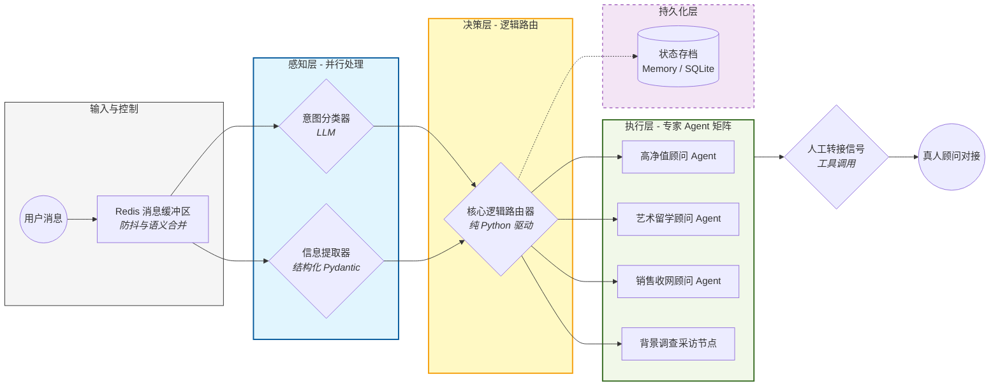

# 暴叔AI (Uncle Bao AI) - 高性能留学顾问 Agent 系统

[English](./README_EN.md) | **中文**

[](https://www.python.org/downloads/)
[](https://github.com/langchain-ai/langgraph)
[](https://fastapi.tiangolo.com/)

> **项目背景**：本系统专为千万级留学网红“暴叔”打造，旨在通过 AI Agent 技术处理高并发业务咨询。系统具备精准的客户画像提取、多维度意图识别及自动化业务分流能力，目前已实现“感知-决策-执行”三层闭环架构。

---

## 🎨 核心架构 (System Architecture)


> 💡 **架构亮点**：采用三层解耦设计，感知层并行化极大降低了延迟；决策层完全由纯逻辑驱动，杜绝了 LLM 的路由幻觉；内置工业级 Redis 缓冲区处理高并发“连珠炮”输入。
> 
> 🔗 **[查看高清中文手绘版架构图 (Excalidraw)](https://excalidraw.com/#json=LpQWIzJznfixXQSMAQTJa,1qBQc0xilYw4aE3KGnLVZw)**

### 核心设计哲学：
1. **Parallel Perception (并行感知)**：通过 LangGraph 的并行节点，同时启动 `Intent Classifier` 与 `Entity Extractor`，利用并发能力降低 LLM 整体响应延迟。
2. **Logic-Decoupled Routing (逻辑解耦路由)**：路由层（Decision Layer）由纯 Python 逻辑驱动，基于 Pydantic 校验的结构化数据做决策，拒绝“路由幻觉”，确保业务确定性。
3. **State Consistency (状态一致性)**：实现自定义 `reduce_profile` 算法，支持增量式信息补全、模糊匹配与字段去重，确保 Source of Truth 的鲁棒性。

---

## 🛠️ 技术栈 (Tech Stack)

*   **Orchestration**: [LangGraph](https://github.com/langchain-ai/langgraph) (基于 DAG 的有向无环图状态管理)
*   **LLMs**: OpenAI / DeepSeek / Gemini (全链路灾备支持)
*   **Backend**: FastAPI (异步高性能 Web 服务)
*   **Data Integrity**: Pydantic v2 (严苛的数据校验与清洗)
*   **Concurrency**: Redis-based Message Buffer (处理用户频繁短句输入的防抖合并机制)

---

## 🚀 核心亮点 (Technical Highlights)

### 1. 工业级状态机与多模型灾备 (High Availability)
系统引入了 `llm_factory` 工厂模式，支持 DeepSeek (Primary) 与 Gemini (Fallback) 的自动切换。通过全局 Builtins 补丁解决了 LangChain 在 Fallback 评估时的作用域问题，确保了 99.9% 的系统可用性。

### 2. 高级消息防抖与并发控制
针对真实业务场景中用户“连珠炮”发消息的习惯，系统在 `utils/buffer.py` 中实现了基于 Redis 的原子锁逻辑，确保同一 Session 内只有一波 AI 任务在运行，并实现语义合并。

### 3. 结构化数据清洗 (Robust Profiling)
在 `state.py` 中实现了 $O(N)$ 复杂度的增量式画像合并算法，通过 Pydantic 严格校验学历、预算、目的地等字段，自动过滤无效冗余信息。

---

## 📂 项目结构

```text
├── agent_graph.py     # 核心 DAG 图定义（并行感知实现）
├── router.py          # 确定性业务分流逻辑
├── state.py           # 核心数据结构与 Pydantic 状态合并
├── config/            # 提示词资产与全局配置
├── nodes/             # 执行层：各赛道专家 Agent 逻辑实现
├── utils/             # Redis 缓冲区、多模型工厂与日志
└── tests/             # 自动化测试用例
```

---

## 🚦 快速启动

1. **配置环境**:
   ```bash
   pip install -r requirements.txt
   cp .env.example .env # 填入 API_KEY
   ```

2. **启动 Redis**:
   ```bash
   redis-server
   ```

3. **运行服务**:
   ```bash
   python main.py
   ```
