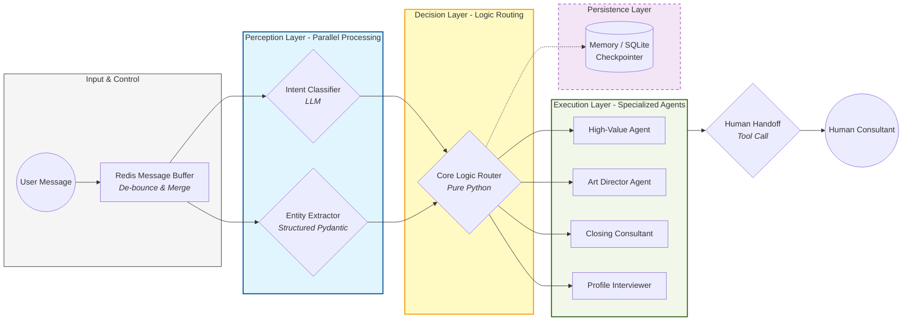
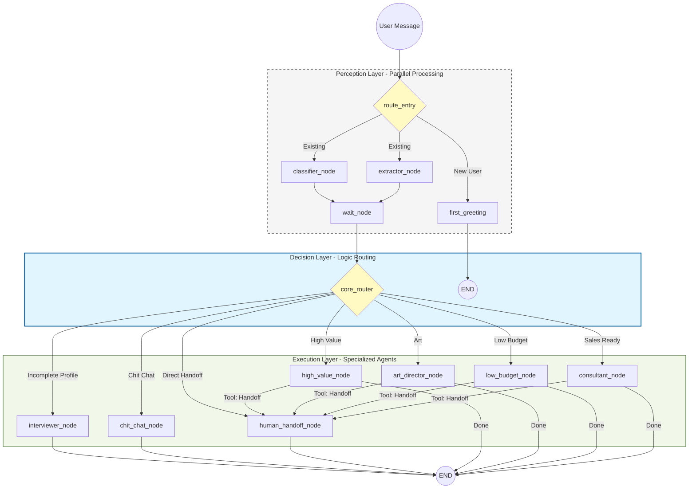

# 暴叔AI (Uncle Bao AI) - 高性能留学顾问 Agent 系统

[](https://www.python.org/downloads/)
[](https://github.com/langchain-ai/langgraph)
[](https://fastapi.tiangolo.com/)

> **项目背景**：本系统专为千万级留学网红“暴叔”打造，旨在通过 AI Agent 技术处理高并发业务咨询。系统具备精准的客户画像提取、多维度意图识别及自动化业务分流能力，目前已实现“感知-决策-执行”三层闭环架构。

---

## 🎨 核心架构 (System Architecture)


> 💡 **架构亮点**：采用三层解耦设计，感知层并行化极大降低了延迟；决策层完全由纯逻辑驱动，杜绝了 LLM 的路由幻觉；内置工业级 Redis 缓冲区处理高并发“连珠炮”输入。
> 
> 🔗 **[查看高清手绘版架构图 (Excalidraw)](https://excalidraw.com/#json=CYEqHumywMgFYCqHs450Q,yKZ7iWNzugZOGMHYBiIRkw)**

### 核心设计哲学：
1. **Parallel Perception (并行感知)**：通过 LangGraph 的并行节点，同时启动 `Intent Classifier` 与 `Entity Extractor`，利用并发能力降低 LLM 整体响应延迟。
2. **Logic-Decoupled Routing (逻辑解耦路由)**：路由层（Decision Layer）由纯 Python 逻辑驱动，基于 Pydantic 校验的结构化数据做决策，拒绝“路由幻觉”，确保业务确定性。
3. **State Consistency (状态一致性)**：实现自定义 `reduce_profile` 算法，支持增量式信息补全、模糊匹配与字段去重，确保 Source of Truth 的鲁棒性。

---

## 🛠️ 技术栈 (Tech Stack)

*   **Orchestration**: [LangGraph](https://github.com/langchain-ai/langgraph) (基于 DAG 的有向无环图状态管理)
*   **LLMs**: OpenAI / DeepSeek (通过 LangChain 适配)
*   **Backend**: FastAPI (异步高性能 Web 服务)
*   **Data Integrity**: Pydantic v2 (严苛的数据校验与清洗)
*   **Concurrency**: Redis-based Message Buffer (处理用户“连珠炮”式输入的防抖与合并机制)

---

## 🚀 核心亮点 (Technical Highlights)

### 1. 工业级状态机 (Industrial-Grade State Machine)
不同于普通的线性对话流，本项目基于 **LangGraph** 构建了复杂的业务图谱。通过 `Sticky Intent` (身份锁定) 机制，当系统识别出用户为“高净值”或“艺术生”后，后续感知层会自动优化提取策略，减少 Token 浪费。

### 2. 消息防抖与合并 (Message De-debouncing)
针对社交平台环境下用户频繁发送短句的习惯，系统在 `utils/buffer.py` 中实现了基于 Redis 的缓冲机制，能在极短时间内对用户输入进行语义合并，防止频繁触发下游 LLM 造成的资源浪费。

### 3. 鲁棒的字段清洗 (Robust Data Cleaning)
在 `state.py` 中，我们为每一个画像字段（学历、预算、目的地）编写了严苛的 `field_validator`，结合 `difflib` 模糊匹配技术，将 LLM 输出的非标文本（如“我想去日本”）精准映射到标准枚举值（“境外方向”）。

---

## 📂 项目结构

```text
├── agent_graph.py     # 核心 DAG 图定义（感知层并行化实现）
├── router.py          # 确定性业务分流逻辑（Decision Layer）
├── state.py           # 核心数据结构与 Pydantic 洗数逻辑
├── nodes/             # 执行层：各赛道专家 Agent (High Value, Art, etc.)
├── utils/             # Redis 缓冲区、日志与工厂模式实现
└── tests/             # 自动化测试用例（覆盖状态合并逻辑与路由分流）
```

---

## 🚦 快速启动

1. **配置环境**:
   ```bash
   pip install -r requirements.txt
   cp .env.example .env # 填入你的 API_KEY
   ```

2. **启动 Redis**: (本系统依赖 Redis 进行消息缓冲)
   ```bash
   redis-server
   ```

3. **运行服务**:
   ```bash
   python main.py
   ```

---

## 🔗 系统细节流程 (Mermaid)

<details>
<summary>点击查看详细节点流转图</summary>


</details>
