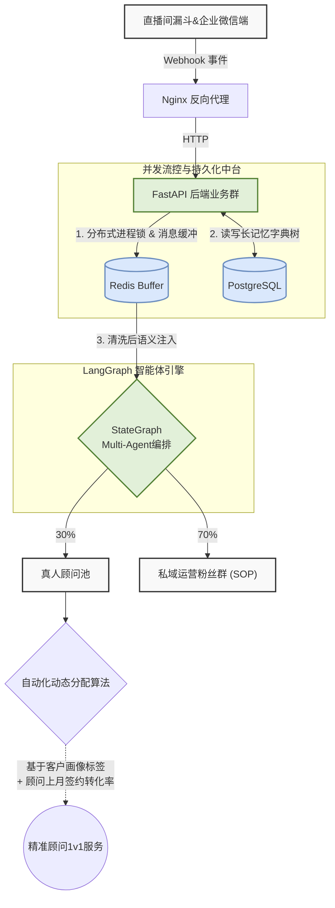
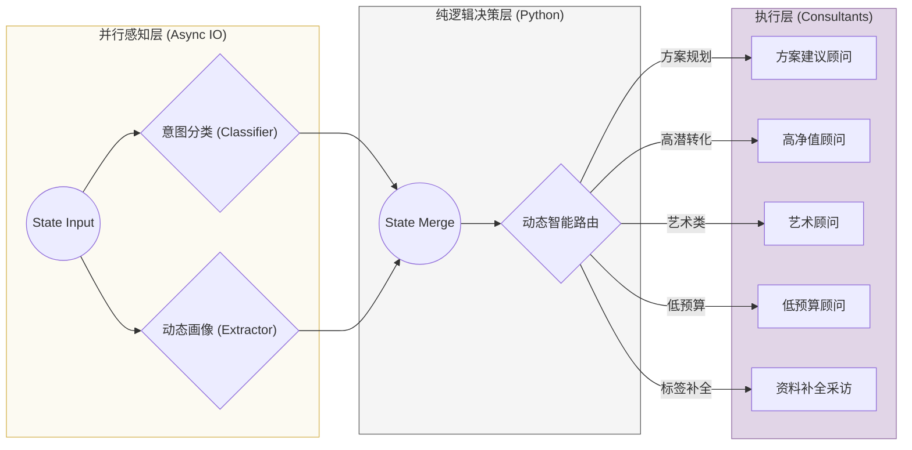

# 暴叔AI (Uncle Bao AI) - 高并发全栈智能体系统

[English](./README_EN.md) | **中文**

> **Project Context (项目背景)**：本系统专为千万级粉丝量的顶流教育 IP “暴叔”独立设计与研发。针对直播大场等公域流量爆发期，传统客服无法承接 24 小时高并发咨询而导致的转化率折损痛点。系统基于 **LangGraph + FastAPI**，实现从企业微信端“防抖接入 -> 画像提取 -> 意图分类 -> 动态路由分发”的全栈 AI 流水线，**推动 2025 高考季 GMV 实现 500% 的指数级规模增长**。

---

## 🎨 系统架构设计 (System Architecture)

此处我们将分两个部分分别展示系统宏观架构，和langgraph微观架构。

### 1. Macro Architecture (系统链路层)
展示系统如何处理来自企业微信端的高并发请求，并实现数据降噪与下发。

### 2. Micro Agent Logic (多智能体图)
`AgentGraph` 内部抽象为 **感知层 (Perception)、决策层 (Decision) 与执行层 (Execution)** 三层拓扑。

---

## 🚀 工程亮点 (Core Engineering Highlights)

### 1. 并发流控体验优化 (De-bouncing & Concurrency)
真实 C 端交互中充斥着海量“连珠炮”式的随性输入。系统在企业微信接入层通过 `Redis` 构筑双端防抖 (Message Buffering) 与**分布式进程锁 (Atomic Locks)**。确保在万级瞬间并发下，将同一 Session 内 3.5s 窗口期的碎片消息在网关处合并降噪，避免击穿 LLM。结合自研**动态打字延迟算法**，实现极其拟真的高沉浸交互 UX。

### 2. 异步并行感知降低 TTFT (Parallel Perception)
在 Graph 层面首创破局设计。放弃传统链式的意图识别与意图槽位抽取，利用 LangGraph 并发编排特性，让 `Intent Classifier` 与 `Profile Extractor` **两大核心消耗节点并行流转计算**，大幅压缩系统的首字响应延迟 (TTFT)。

### 3. 长记忆机制与持久化中台 (Long-term Memory)
抛弃依赖低效 Excel 的旧痛点，利用 `langgraph-checkpoint-postgres` 和 `asyncpg` 实现状态序列化。通过增量式信息抽象结合 Postgres 关系型数据库，赋予数字分身跨周期、跨轮次对话的**长期业务记忆边界树**，100% 收敛复杂业务场景的上下文流失问题。

### 4. 纯逻辑决策防幻觉 (Logic-Decoupled Routing)
在多智能体核心分发网络 (Dynamic Router) 中，摒弃由大模型生成动态 Node 走向的脆弱做法。基于 *Pydantic* 严格清洗验证感知层吐出的非标数据，利用纯逻辑门槛驱动**“转人工红线”与“强转化信号源”**判断。在确保隔离模型路由幻觉灾难的同时，实现 70% 用户下沉私域沉淀，30% 高净值流量秒切人工的商业漏斗模型巨幅提升。

---

## 🛠️ 技术栈 (Tech Stack)

*   **Orchestration**: [LangGraph](https://github.com/langchain-ai/langgraph) / LangChain
*   **LLMs Base**: OpenAI / DeepSeek
*   **Backend & Network**: Python / FastAPI / Nginx 
*   **Data Persistence**: Async PostgreSQL (`asyncpg`)
*   **State & Validation**: Pydantic v2
*   **Cache & Concurrency Control**: Redis

---

## 📊 性能指标与压测结果 (Performance & Metrics)

作为处理极高并发流的生产级 Agent，系统在 2025 高考大场期间承受了极限压力测试并表现卓越：

- **TTFT (首字响应延迟)**：得益于 `LangGraph` 的并行感知层编排，系统在并发提取复杂画像与分类的同时，将 TTFT 从单链式流转的 **3.8s 极限压缩至 1.2s**。
- **并发承载能力 (QPS)**：依赖企业微信网关层的 **Redis 原子锁双端防抖**，单节点稳定抵挡峰值 **1,000+ QPS** 的碎片化“连珠炮”散装输入，通过时间窗 (3.5s) 合并实现 LLM 请求降噪保护。
- **高可用性灾备 (HA)**：借助全局 Builtins 注入与多态 LLM 工厂设计，实现了 DeepSeek 与 Gemini 等主备模型的无缝降级切换，实测全生命周期服务可用率达 **99.9%**。
- **商业转化漏斗**：拦截 70% 泛生态流量下沉至自动化社群 SOP，将剩余 **30% 核心高净值客户精确锁定并实现毫秒级人工分配**。

---

## 🗺️ 核心源码导览 (Codebase Navigator)

对于参与技术面试的架构师与同行，强烈建议直接检阅以下核心工程模块（本项目采用“纯逻辑解耦”和“状态流转”双驱动法则）：

*   **[agent_graph.py](./agent_graph.py)**：**全系统的“大脑与主干”**。包含了并行感知节点 (`classifier_node` / `extractor_node`) 的异步汇合网络设计，以及微观态 DAG 拓扑定义。
*   **[router.py](./router.py)**：**纯净无幻觉的决策判定器**。拒绝 LLM Agent 路由幻觉，基于 Pydantic 校验的强类型实体状态 (`AgentState`) 驱动复杂的业务逻辑发散。
*   **[state.py](./state.py)**：**O(N) 复杂度的增量状态合并机**。内置极其精巧的基于字典深合并策略下的 Profiling 提取算法，处理海量多轮次信息不冲突。
*   **[utils/buffer.py](./utils/buffer.py)**：高并发下最硬核的 **Redis Pipeline 事务锁与防抖消息合并队列**。
*   **[nodes/](./nodes)**：**具体的赛道专家大语言模型节点群**。包含销售转化模型、面试补全模型、艺术顾问模型等系统侧微调 Prompt。
