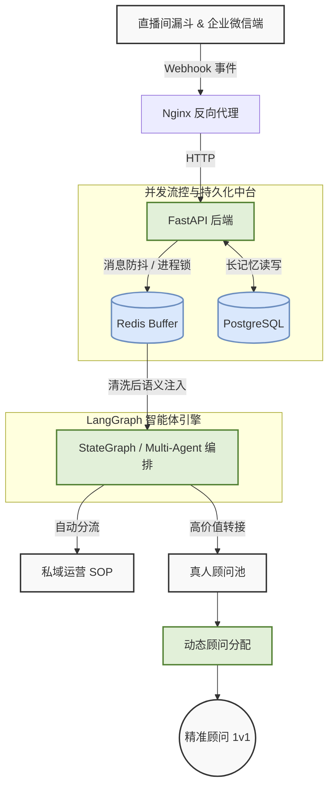
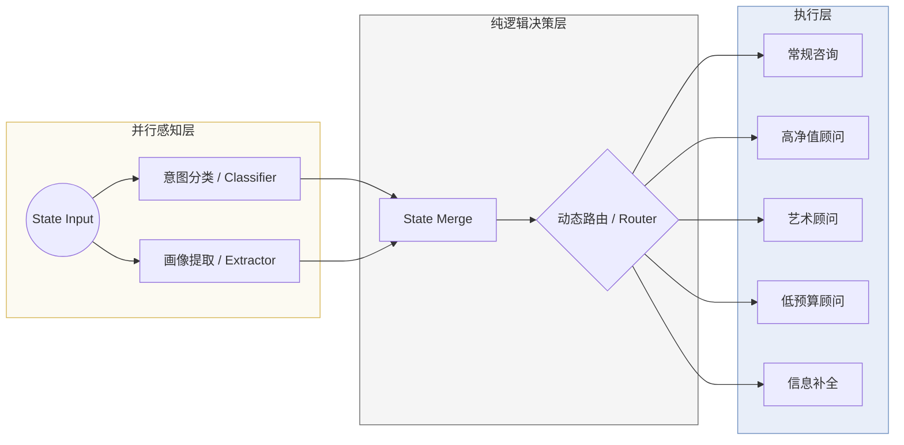

# 暴叔 AI

[English](./README_EN.md) | **中文**

暴叔 AI 是一个部署在企业微信和 Web 端的留学咨询智能体系统，负责消息防抖、客户画像提取、意图分类、动态路由、转人工与评测闭环。

## 架构

### 1. Macro Architecture



### 2. Micro Agent Logic



## 核心能力

- 企业微信与 Web 双入口接入
- Redis 防抖与消息缓冲
- `classifier` 与 `extractor` 并行感知
- 基于 Python 规则的确定性路由
- 顾问节点分流：常规、高净值、艺术、低预算、信息补全
- extractor 评测流水线与 failure analysis

## 技术栈

- Python 3.10+
- FastAPI
- LangGraph / LangChain
- PostgreSQL
- Redis
- Pydantic v2
- DeepSeek / OpenAI / Gemini

## 仓库结构

```text
.
├── main.py                      # FastAPI 入口，Web / 企业微信接入
├── agent_graph.py               # LangGraph 工作流定义
├── state.py                     # 共享状态与 profile 合并逻辑
├── router.py                    # 纯 Python 路由逻辑
├── nodes/                       # 业务节点
├── utils/                       # buffer、日志、企微 API、LLM 工厂
├── db/                          # Postgres 存储与 schema
├── config/                      # prompts 与配置项
├── tests/                       # 单元测试与集成测试
├── nodes_eval/extractor_eval/   # extractor eval 数据、脚本、failure analysis
├── scripts/                     # 环境初始化脚本
├── static/                      # Web 静态资源
└── data/                        # 共享数据文件
```

## 环境准备

默认开发环境为 conda `agent`。

```bash
conda activate agent
pip install -r requirements.txt
```

需要的环境变量建议放在项目根目录 `.env`，常见项包括：

```bash
DEEPSEEK_API_KEY=...
GOOGLE_API_KEY=...
OPENAI_API_KEY=...
DATABASE_URL=...
WECOM_CORPID=...
WECOM_SECRET=...
WECOM_TOKEN=...
WECOM_AES_KEY=...
WECOM_KF_ID=...
```

## 本地运行

启动应用：

```bash
conda activate agent
python main.py
```

默认监听：

- `http://0.0.0.0:8000`

主要入口：

- Web: `/`
- Web API: `/chat`
- 企业微信回调: `/api/wecom/callback`

## 测试

运行完整测试集：

```bash
conda activate agent
PYTHONPATH=. pytest tests -q
```

常用测试：

```bash
conda activate agent
PYTHONPATH=. pytest tests/test_nodes_unit.py tests/test_profile_state.py -q
```

## Extractor Eval

黄金数据集与脚本在 [nodes_eval/extractor_eval](/Users/jackywang/Documents/baoshu_ai/nodes_eval/extractor_eval)。

生成黄金集：

```bash
conda activate agent
PYTHONPATH=. python nodes_eval/extractor_eval/generate_dataset.py
```

运行 eval：

```bash
conda activate agent
PYTHONPATH=. python nodes_eval/extractor_eval/run_eval.py --concurrency 8
```

关键文件：

- [golden_dataset.json](/Users/jackywang/Documents/baoshu_ai/nodes_eval/extractor_eval/golden_dataset.json)
- [benchmark.py](/Users/jackywang/Documents/baoshu_ai/nodes_eval/extractor_eval/benchmark.py)
- [failure_analysis.py](/Users/jackywang/Documents/baoshu_ai/nodes_eval/extractor_eval/failure_analysis.py)
- [eval_progress_20260317.md](/Users/jackywang/Documents/baoshu_ai/nodes_eval/extractor_eval/eval_progress_20260317.md)

## 部署

默认走 [deploy.sh](/Users/jackywang/Documents/baoshu_ai/deploy.sh)。详细发布流程已迁移到 `baoshu-git-deploy` skill，不再在仓库文档中重复维护。

## 数据与文件约定

- `.obsidian/`、`README.pdf` 等本地工作文件不入库
- `data/` 中被运行时依赖的共享文件应入库
- `.ipynb_checkpoints/`、`.mypy_cache/`、`__pycache__/` 等工具产物不入库
- failure analysis 中间产物默认仅做本地归档，不作为主仓库长期资产

## 相关脚本

- [deploy.sh](/Users/jackywang/Documents/baoshu_ai/deploy.sh): 发布入口
- [scripts/setup_postgres_server.sh](/Users/jackywang/Documents/baoshu_ai/scripts/setup_postgres_server.sh): 初始化 PostgreSQL

## 说明

- 未经明确要求，不修改业务 `system_prompt`
- 业务逻辑改动前，优先新增测试或补足回归验证
- 多文件治理或架构性调整应单开分支处理
