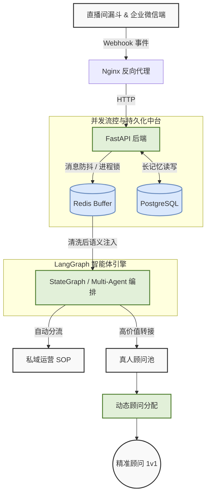
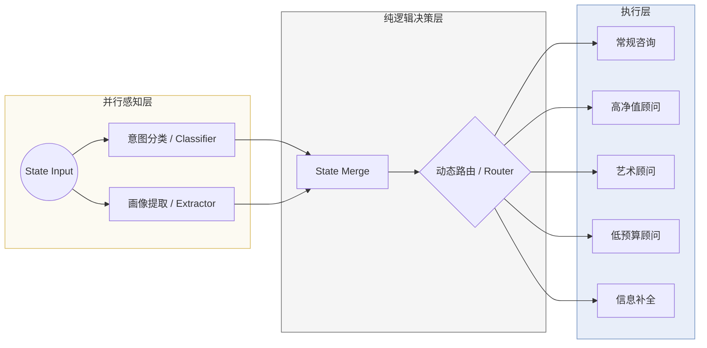

# 暴叔 AI

[English](./README_EN.md) | **中文**

暴叔 AI 是一个部署在企业微信和 Web 端的留学咨询智能体系统，负责消息防抖、客户画像提取、意图分类、动态路由、转人工与评测闭环。

## 架构

### 1. Macro Architecture



### 2. Micro Agent Logic



## 核心能力

- 企业微信与 Web 双入口接入
- Redis 防抖与消息缓冲
- `classifier` 与 `extractor` 并行感知
- 基于 Python 规则的确定性路由
- 顾问节点分流：常规、高净值、艺术、低预算、信息补全
- extractor / classifier / router / execution 节点评测流水线与 failure analysis

## 技术栈

- Python 3.10+
- FastAPI
- LangGraph / LangChain
- PostgreSQL
- Redis
- Pydantic v2
- DeepSeek / OpenAI / Gemini

## 仓库结构

```text
.
├── main.py                      # FastAPI 入口，Web / 企业微信接入
├── agent_graph.py               # LangGraph 工作流定义
├── state.py                     # 共享状态与 profile 合并逻辑
├── router.py                    # 纯 Python 路由逻辑
├── nodes/                       # 业务节点
├── utils/                       # buffer、日志、企微 API、LLM 工厂
├── db/                          # Postgres 存储与 schema
├── config/                      # prompts 与配置项
├── tests/                       # 单元测试与集成测试
├── nodes_eval/extractor_eval/   # extractor eval 数据、脚本、failure analysis
├── nodes_eval/classifier_eval/  # classifier eval 数据、脚本、failure analysis
├── nodes_eval/router_eval/      # router eval 数据、脚本、failure analysis
├── nodes_eval/execution_eval/   # 执行层节点 eval 数据、脚本、failure analysis
├── scripts/                     # 环境初始化脚本
├── static/                      # Web 静态资源
└── data/                        # 共享数据文件
```

## 启动

```bash
pip install -r requirements.txt
python main.py
```

## 测试

```bash
PYTHONPATH=. pytest tests -q
```

## Eval Pipelines

```bash
PYTHONPATH=. python nodes_eval/extractor_eval/generate_dataset.py
PYTHONPATH=. python nodes_eval/extractor_eval/run_eval.py --concurrency 8
PYTHONPATH=. python nodes_eval/classifier_eval/run_eval.py --concurrency 8
PYTHONPATH=. python nodes_eval/router_eval/run_eval.py
PYTHONPATH=. python nodes_eval/execution_eval/run_eval.py
```

关键文件：

- [golden_dataset.json](/Users/jackywang/Documents/baoshu_ai/nodes_eval/extractor_eval/golden_dataset.json)
- [benchmark.py](/Users/jackywang/Documents/baoshu_ai/nodes_eval/extractor_eval/benchmark.py)
- [failure_analysis.py](/Users/jackywang/Documents/baoshu_ai/nodes_eval/extractor_eval/failure_analysis.py)
- [eval_progress_20260317.md](/Users/jackywang/Documents/baoshu_ai/nodes_eval/extractor_eval/eval_progress_20260317.md)
- [classifier_eval](/Users/jackywang/Documents/baoshu_ai/nodes_eval/classifier_eval/README.md)
- [router_eval](/Users/jackywang/Documents/baoshu_ai/nodes_eval/router_eval/README.md)
- [execution_eval](/Users/jackywang/Documents/baoshu_ai/nodes_eval/execution_eval/README.md)
