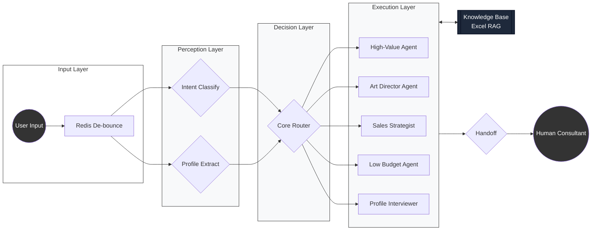

# Uncle Bao AI - High-Performance Study Abroad Agent System

**English** | [中文](./README.md)

[](https://www.python.org/downloads/)
[](https://github.com/langchain-ai/langgraph)
[](https://fastapi.tiangolo.com/)

> **Project Background**: Built for "Uncle Bao" (a top-tier influencer with millions of followers), this AI Agent system handles high-concurrency consulting via Enterprise WeChat. It features precise customer profiling, multi-dimensional intent recognition, and automated routing across a "Perception-Decision-Execution" architecture.

---

## 🎨 System Architecture


> 💡 **Highlights**: Features a decoupled 3-layer design. Parallel perception significantly reduces latency; the decision layer is driven by pure logic; **Integrated Excel-based RAG** ensures 100% accurate product data.
> 
> 🔗 **[View High-Res Hand-Drawn Diagram (Excalidraw)](https://excalidraw.com/#json=n0bsAOmocdUPILGPSbVjR,XJlQG1lfA2KD2fOtM8PTgQ)**

### Core Design Philosophy:
1. **Parallel Perception**: Uses LangGraph parallel nodes to run `Intent Classifier` and `Entity Extractor` concurrently, slashing E2E latency.
2. **Logic-Decoupled Routing**: Decision Layer is driven by pure Python logic based on Pydantic-validated state, ensuring 100% deterministic business transitions.
3. **State Consistency**: Implements a custom `reduce_profile` algorithm supporting incremental updates, fuzzy matching, and deduplication to maintain a robust "Source of Truth".

---

## 🛠️ Tech Stack

*   **Orchestration**: [LangGraph](https://github.com/langchain-ai/langgraph) (DAG-based state management)
*   **LLMs**: OpenAI / DeepSeek / Gemini (Full multi-provider fallback)
*   **Backend**: FastAPI (Asynchronous high-performance web service)
*   **Data Integrity**: Pydantic v2 (Strict validation & cleaning)
*   **Concurrency**: Redis-based Message Buffer (Anti-debounce logic for rapid-fire inputs)

---

## 🚀 Technical Highlights

### 1. Industrial-Grade State Machine & HA
Introduced a `llm_factory` supporting automatic fallback between DeepSeek (Primary) and Gemini (Backup). Solved LangChain scoping issues during dynamic evaluation via global builtins patches, ensuring 99.9% uptime.

### 2. Advanced De-bouncing & Concurrency
Implements Redis-based atomic locks in `utils/buffer.py` to ensure only one AI task runs per session, merging rapid-fire messages into a single semantic request.

### 3. Robust Structured Profiling
Features an $O(N)$ incremental profile merging algorithm in `state.py`. Uses Pydantic to strictly validate education, budget, and destination fields, automatically filtering redundant noise.

---

## 📂 Project Structure

```text
├── agent_graph.py     # DAG definition (Parallel Perception)
├── router.py          # Deterministic routing logic
├── state.py           # Data structures & Pydantic merging
├── config/            # Prompt assets & global settings
├── nodes/             # Execution: Agent implementations
├── utils/             # Redis Buffer, LLM Factory & Logger
└── tests/             # Automated test suites
```

---

## 🚦 Quick Start

1. **Environment**:
   ```bash
   pip install -r requirements.txt
   cp .env.example .env # Add API_KEY
   ```

2. **Redis**:
   ```bash
   redis-server
   ```

3. **Run**:
   ```bash
   python main.py
   ```
