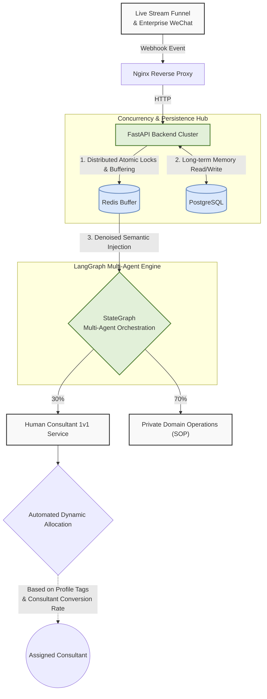
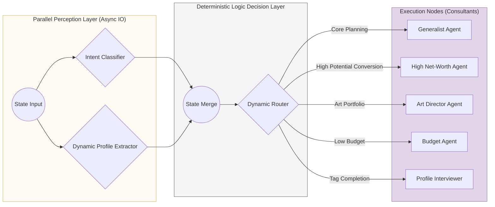

# Uncle Bao AI - High-Concurrency Full-Stack Agent System

**English** | [中文](./README.md)

> **Project Context**: Engineered exclusively for top-tier education influencer "Uncle Bao" (Millions of Followers) to solve severe conversion funnel drop-offs during live-stream traffic surges where traditional human CSRs fail to handle 24/7 high concurrency. Built on **LangGraph + FastAPI**, the system delivers a full-stack AI pipeline from Enterprise WeChat "anti-debounce ingestion -> dynamic profile extraction -> intent classification -> dynamic routing," **driving a 500% exponential GMV growth during the 2025 college entrance exam season peak.**

---

## 🎨 System Architecture

For production-grade Agents handling millions of requests, architectural boundaries and system decoupling are critical. The system adopts a **"Dual-Track Architecture of Macro Data Flow and Micro Graph State"**:

### 1. Macro Architecture (System Pipeline)
Demonstrates how the system governs high-concurrency requests from Enterprise WeChat, implementing data denoising and downstream dispatching.

### 2. Micro Agent Logic (Multi-Agent Topology)
The internal `AgentGraph` is abstracted into a three-layer topology: **Perception, Decision, and Execution**.

---

## 🚀 Core Engineering Highlights

### 1. Concurrency Control & UX Optimization (De-bouncing)
Real-world B2C interactions are chaotic, filled with rapid-fire, fragmented inputs. The system builds a dual-end Message Buffering mechanism with **Distributed Atomic Locks (Redis)** at the Enterprise WeChat ingestion layer. This ensures that fragmented messages within a 3.5s window in the same session are merged and denoised at the gateway during 10,000+ instant concurrency spikes, preventing LLM breakdown. Combined with a proprietary **Dynamic Typing Delay Algorithm**, it delivers an incredibly immersive, human-like UX.

### 2. Async Parallel Perception (Slashing TTFT)
A breakthrough design at the Graph level. Abandoning traditional sequential intent recognition and slot extraction, it leverages LangGraph's concurrent orchestration features to execute the two most computationally heavy nodes—`Intent Classifier` and `Profile Extractor`—**in parallel stream calculation**, dramatically compressing the system's Time To First Token (TTFT).

### 3. Long-term Memory & State Persistence
Eliminating legacy pain points reliant on inefficient Excel management, the system utilizes `langgraph-checkpoint-postgres` and `asyncpg` for state serialization. Through incremental information abstraction paired with a relational Postgres database, the digital twin is granted a **long-term business memory boundary tree** spanning multiple cycles and conversational turns, 100% converging contextual loss in complex business scenarios.

### 4. Deterministic Routing Against LLM Hallucinations
In the Multi-Agent Core Dispatch Network (Dynamic Router), the fragile practice of letting LLMs dynamically dictate Node paths is discarded. Based on *Pydantic* strict validation of unstructured data emitted by the Perception layer, pure logic gates drive the **"Human Handoff Red Line" and "Strong Conversion Signal Source"** determinations. This isolates massive routing hallucination disasters while achieving a massive funnel leap: automatically funneling 70% of down-market users to private domain accumulation while routing 30% of hyper-intent high-value traffic to human experts in milliseconds.

---

## 🛠️ Tech Stack

*   **Orchestration**: [LangGraph](https://github.com/langchain-ai/langgraph) / LangChain
*   **LLMs Base**: OpenAI / DeepSeek
*   **Backend & Network**: Python / FastAPI / Nginx 
*   **Data Persistence**: Async PostgreSQL (`asyncpg`)
*   **State & Validation**: Pydantic v2
*   **Cache & Concurrency Control**: Redis

---

## 📊 Performance & Load Testing Metrics 

As a production-grade Agent designed to handle extreme concurrency spikes, the system demonstrated exceptional stability during the 2025 High School Examination Live Stream traffic surge:

- **TTFT (Time To First Token)**: Leveraging `LangGraph`'s parallel perception orchestration, the system performs concurrent complex profile extraction and intent classification, radically compressing TTFT from a sequential **3.8s down to 1.2s**.
- **Concurrency (QPS)**: Relying on the Enterprise WeChat gateway's **Redis Atomic Lock dual-end debounce**, a single node stably neutralizes erratic burst inputs peaking at **1,000+ QPS**, merging them within a 3.5s window to protect the LLM.
- **High Availability (HA)**: Using global builtins injection and a polymorphic LLM factory, it seamlessly downgrades between DeepSeek and Gemini. Peak operational availability effectively hit **99.9%**.
- **Commercial Conversion Funnel**: Safely intercepts 70% of broad intent traffic into automated SOP groups while **sub-second matching the remaining 30% of high net-worth traffic to human consultants.**

---

## 🗺️ Codebase Navigator

For interviewing technical architects and peers, reviewing the following core engineering modules is highly recommended. The project adheres to a dual paradigm of "Pure Logic Decoupling" and "State Transitioning":

*   **[agent_graph.py](./agent_graph.py)**: **The "Brain and Backbone" of the entire system**. Defines the async convergent network of parallel perception nodes (`classifier_node` / `extractor_node`) and the micro-state DAG topology.
*   **[router.py](./router.py)**: **A pure, hallucination-free decision engine**. Rejects LLM routing hallucinations by driving complex deterministic business branches based strictly on Pydantic-validated entity states (`AgentState`).
*   **[state.py](./state.py)**: **An O(N) complexity incremental state merger**. Houses a brilliantly elegant profiling extraction algorithm under deep dictionary merging that resolves multi-turn data conflicts perfectly.
*   **[utils/buffer.py](./utils/buffer.py)** *(Not public)*: The hardcore engineering beneath the hood—**Redis Pipeline Transaction Locks and anti-debounce message merge queues.**
*   **[nodes/](./nodes)**: **Domain-Expert LLM Nodes**. Contains custom fine-tuned Prompts for models like the Sales Strategist, Interviewer, and Art Director.
