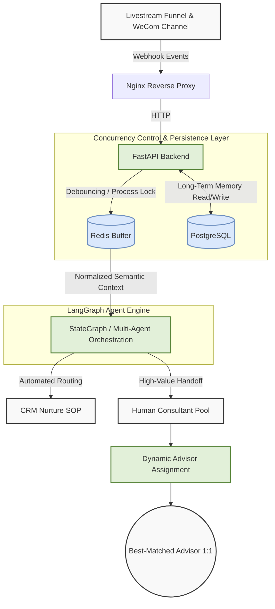
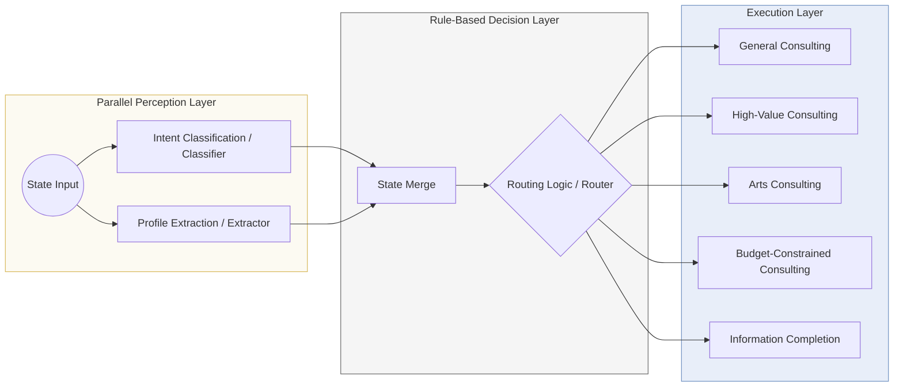

# BaoShu AI

**English** | [中文](./README.md)

BaoShu AI is an AI orchestration system for international admissions consulting, deployed across WeCom (Enterprise WeChat) and the web. It handles ingress debouncing, customer profile extraction, intent classification, rule-based routing, human handoff, and closed-loop evaluation across the end-to-end workflow.

## Architecture

### 1. Macro Architecture



### 2. Micro Agent Logic



## Core Capabilities

- Dual entry points via WeCom and the web
- Redis-backed debouncing and message buffering
- Parallel signal extraction through `classifier` and `extractor`
- Deterministic routing implemented in Python
- Specialized advisor nodes for general, high-value, arts, budget-constrained, and information-completion flows
- Evaluation pipelines and failure analysis for extractor / classifier / router / execution nodes

## Tech Stack

- Python 3.10+
- FastAPI
- LangGraph / LangChain
- PostgreSQL
- Redis
- Pydantic v2
- DeepSeek / OpenAI / Gemini

## Repository Layout

```text
.
├── main.py                      # FastAPI entry point for web and WeCom ingress
├── agent_graph.py               # LangGraph workflow definition
├── state.py                     # Shared state and profile merge logic
├── router.py                    # Pure Python routing logic
├── nodes/                       # Advisor and business node implementations
├── utils/                       # Buffering, logging, WeCom API, and LLM factory
├── db/                          # PostgreSQL storage and schema
├── config/                      # Prompts and runtime configuration
├── tests/                       # Unit and integration tests
├── nodes_eval/extractor_eval/   # Extractor eval data, scripts, and failure analysis
├── nodes_eval/classifier_eval/  # Classifier eval data, scripts, and failure analysis
├── nodes_eval/router_eval/      # Router eval data, scripts, and failure analysis
├── nodes_eval/execution_eval/   # Execution-node eval data, scripts, and failure analysis
├── scripts/                     # Environment bootstrap scripts
├── static/                      # Web static assets
└── data/                        # Shared data files
```

## Run

```bash
pip install -r requirements.txt
python main.py
```

## Tests

```bash
PYTHONPATH=. pytest tests -q
```

## Eval Pipelines

```bash
PYTHONPATH=. python nodes_eval/extractor_eval/generate_dataset.py
PYTHONPATH=. python nodes_eval/extractor_eval/run_eval.py --concurrency 8
PYTHONPATH=. python nodes_eval/classifier_eval/run_eval.py --concurrency 8
PYTHONPATH=. python nodes_eval/router_eval/run_eval.py
PYTHONPATH=. python nodes_eval/execution_eval/run_eval.py
```

Key files:

- [golden_dataset.json](/Users/jackywang/Documents/baoshu_ai/nodes_eval/extractor_eval/golden_dataset.json)
- [benchmark.py](/Users/jackywang/Documents/baoshu_ai/nodes_eval/extractor_eval/benchmark.py)
- [failure_analysis.py](/Users/jackywang/Documents/baoshu_ai/nodes_eval/extractor_eval/failure_analysis.py)
- [eval_progress_20260317.md](/Users/jackywang/Documents/baoshu_ai/nodes_eval/extractor_eval/eval_progress_20260317.md)
- [classifier_eval](/Users/jackywang/Documents/baoshu_ai/nodes_eval/classifier_eval/README.md)
- [router_eval](/Users/jackywang/Documents/baoshu_ai/nodes_eval/router_eval/README.md)
- [execution_eval](/Users/jackywang/Documents/baoshu_ai/nodes_eval/execution_eval/README.md)
