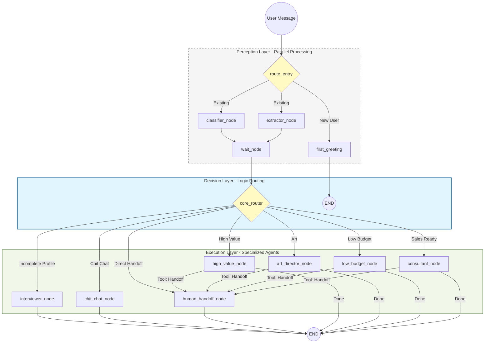

# System Architecture Diagram

This file contains the Mermaid.js source for the Uncle Bao AI architecture.

## Architecture Highlights for Interviews

1. **Layered Design**: Separation of concerns between Perception (Understanding), Decision (Routing), and Execution (Action).
2. **Parallel Execution**: `classifier` and `extractor` run in parallel to minimize LLM latency.
3. **Deterministic Routing**: The `core_router` uses structured state (Pydantic) rather than raw LLM prompts to decide transitions, ensuring system stability.
4. **Resilient State**: Custom `reduce_profile` logic handles incremental data updates and fuzzy matching for messy user inputs.
